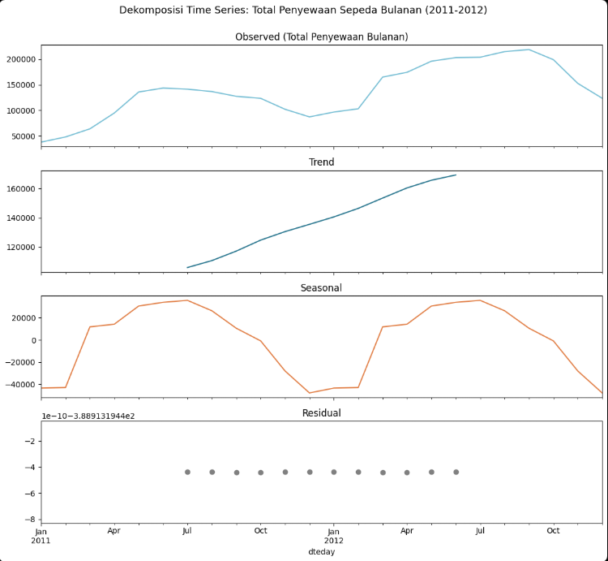
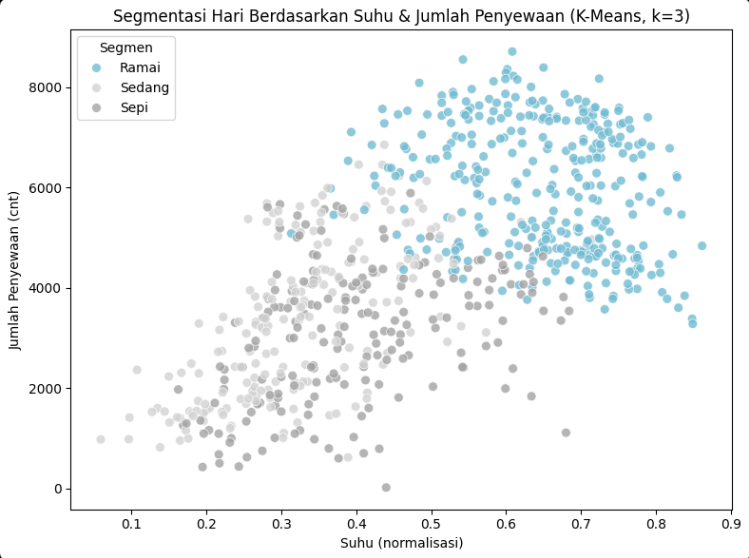
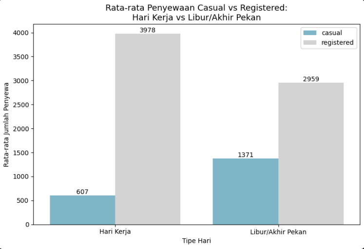

# Bike Sharing Demand: Weather Clustering & Time Series Analysis


> **View the visual summary on my [Portfolio Website ↗]([MASUKKAN_LINK_WEBSITE_PORTOPOLIO_KAMU_DISINI])**


## 📌 Business Problem
Capital Bikeshare's rental demand is highly volatile, driven by external environmental factors (seasons, weather) and distinct user segments (casual renters vs. registered members). Without a data-driven model to understand these demand triggers, the business risks inefficient fleet distribution, missed revenue during peak conditions, and ineffective "one-size-fits-all" marketing strategies.

## 🗂️ Data & Technical Methodology
Analyzed **731 days of data (2011–2012)** encompassing **3.29 million transactions**. The raw data was impeccably clean (0 missing values, 0 duplicates), allowing the analysis to focus heavily on feature enrichment and machine learning rather than basic repair.

**Technical Approach:**
1. **Time Series Decomposition:** Applied `statsmodels` to separate genuine YoY growth (trend) from recurring seasonal noise.
2. **Feature Engineering & Scaling:** Standardized numerical weather features (temp, humidity, windspeed) using `StandardScaler` to prevent feature dominance based on scale magnitude.
3. **Unsupervised Learning (Clustering):** Deployed a **K-Means clustering** algorithm (optimized to $k=3$ via the Elbow Method) to mathematically group days into distinct demand profiles based on weather conditions.

---

## 📊 Key Insights & Visualizations

### 1. Genuine Growth vs. Seasonal Noise
In 2012, total rentals surged to 2.05M (a massive **64.9% YoY growth** from 2011). To prove this wasn't just seasonal luck, I applied Time Series Decomposition. The visualization below extracts the pure `Trend` line, confirming that the business is experiencing genuine, underlying baseline growth independent of the summer peak. 


*Insight: The capacity must be permanently expanded to handle the new baseline, not just temporarily adjusted for summer.*

### 2. K-Means: Discovering Demand Profiles
Weather dictates demand, but how do we classify it? Using K-Means clustering on temperature, humidity, and rental volume, the algorithm naturally discovered **3 Demand Segments**:
* **Busy Days (Green):** Warm temps & moderate humidity. Peak optimal conditions.
* **Moderate Days (Blue):** Colder and windier.
* **Quiet Days (Red):** Bad weather (rain/light snow), where rentals plummet by up to 63% (averaging only 3,113/day).


*Insight: Operations can integrate weather forecasts to preemptively balance bike stations 48 hours in advance based on these 3 specific cluster thresholds.*

### 3. The User Dichotomy: Casual vs. Registered
The data revealed a complete behavioral opposite between the two user bases. **Registered members** dominate on workdays (peaking at ~4,000/day), utilizing the bikes for commuting. Conversely, **Casual users** hibernate during the week but surge by 2x on weekends (recreational use).


*Insight: Pricing and marketing must be split. Offer weekday subscription discounts to convert casual riders into registered commuters, and launch weekend leisure campaigns targeted solely at casual riders.*

---

## 💡 Business Recommendations
1. **Dynamic Fleet Allocation:** Integrate the K-Means weather clusters with logistics. Move bikes to residential areas before "Busy" workdays, and to tourist hubs before "Busy" weekends.
2. **Targeted Conversion:** Capitalize on the weekend casual surge by offering "First-Month Free" commuter registrations on Saturday/Sunday.
3. **Capacity Planning:** The 64.9% YoY trend growth indicates that the current fleet size will bottleneck revenue in 2013. Immediate fleet acquisition is required.

## 📂 Repository Structure
```text
├── data/
│   └── day.csv                    # Original daily aggregated dataset
├── images/                        # Visualizations & dashboard screenshots
├── notebooks/
│   └── bike_sharing_analysis.ipynb # Main EDA, Time Series, and K-Means code
├── app/
│   └── dashboard.py               # (Optional) Streamlit dashboard source code
├── requirements.txt               # Dependencies (pandas, scikit-learn, etc.)
└── README.md
